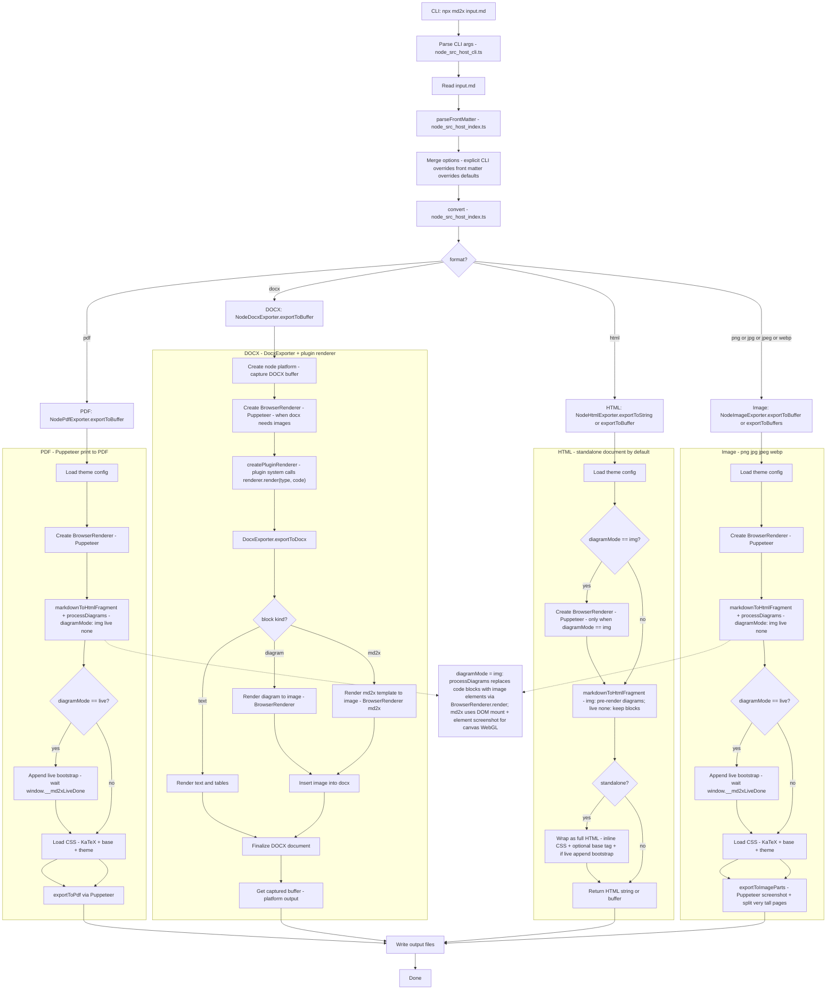

# md2x Node/CLI Conversion Flow (by format)

This diagram summarizes the current Node/CLI pipeline (`node/src/host/cli.ts` -> `node/src/host/index.ts` -> exporters in `node/src/host/node-exporter.ts`)
and how it branches by `format`.

