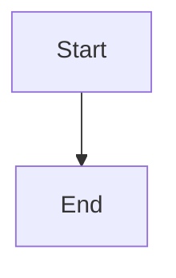

# Diagram Mode None Test

This document tests `diagramMode: none` option.

## Mermaid Code Block (Should Remain as Code)

```mermaid
flowchart TD
    A[Start] --> B[End]
```

The above should remain as a code block, not rendered as a diagram.
